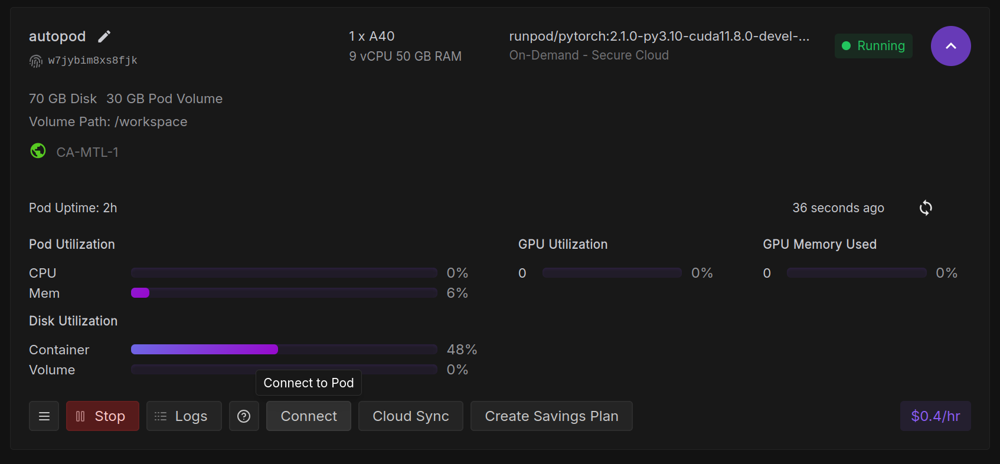

# Instructions
If you started a new RunPod instance, run these commands *in order* to set up the testing environment. The entire process takes about *10 minutes* to run so maybe don't restart your pod everyday (every Monday is OK). 

## Pre Installation
In order to even connect to your pod, you need to change the port number (and potentially HostName if you are starting a brand new pod and not restarting a pod that you have previously stopped) in your `.ssh/config`. 

The HostName and port of the pod can be found as follows. Keep these in-mind as they will be needed later in the Claude Code setup. 


Since the startup code (this file) is in you repo, you shoult clone into it first. 
1. Start two terminals
2. Clone the `main` branch of your forked repo. If you have a branch `my_branch` that you are working on, you can checkout the working branch with the following instructions:

```bash
git checkout my_branch
git branch # make sure you are on the right branch
```
3. Install the python extension to your ssh instance. 
4. Start a tunnel with the command: 

`ssh -L 54545:localhost:54545 root@[HostName] -p [Port]`

From the two times I have checked it, Claude is listening on port `54545`, but if you find that this does not work, there is code in the `run_claude.sh` file to figure it out again. 

*Note that this will add the host to your `~/.ssh/known_hosts` file. To keep the file clean, it is good idea to the entry every time you stop the pod.*

## Step-by-Step Installation Guide
1. Run `. run_pod.sh`.
    1. Install `uv` to manage requirements (often already installed but best to be safe).
    2. Install packages from `requirements.txt`. 
    2. Set up Github credentials so you can push changes to remote. 
2. Source the virtual environment that you created using `. .venv/bin/activate`. After this you should see `(latentqa)` at the beginning of all your commands.
3. Run `. run_hugging.sh`.
    1. Setup Hugging Face secret tokens so you can download restricted models. 
    2. Populate the environmental variable `PATH_TO_DECODER` with the name of the model you are using as the decoder from Hugging Face.
4. Source your bashrc using `. ~/.bashrc` since some environmental variables have been added.  
5. Run `. run_claude.sh`.
    1. Install `nodejs` mostly for the `npm` command.
    2. Install Claude Code.
    3. Run `claude` in the terminal.
    4. You will get a bunch of setup instructions, but the most important is linking your claude.ai account (with the pro subscription). You will get a weblink which you will need to copy into a website on your local machine. Go through the links and --- if you set things up properly in the pre-installation step 4, you should be able to tunnel back to your remote machine and get a key which you can then past into the terminal of your remote machine. 

# Others
## Tiny Benchmarks
In order to run Tiny Benchmarks, you need to do the following. 
```bash
# Clone without submodules
git clone --depth 1 https://github.com/felipemaiapolo/tinyBenchmarks.git
cd tinyBenchmarks

# Remove the problematic submodule reference
rm -rf .gitmodules tutorials/py-irt

# Install
uv pip install .
cd ..
```